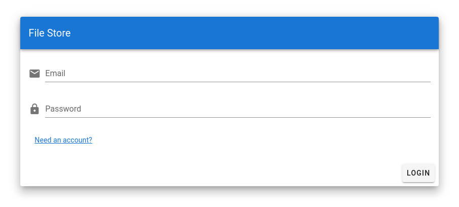
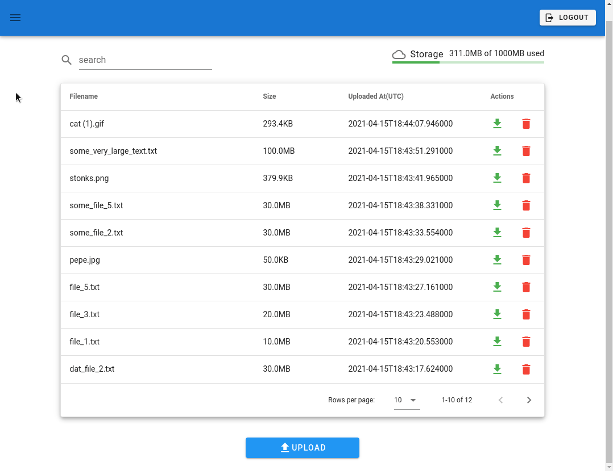

# File Store
[](https://codecov.io/gh/person0709/woven-fs)
[](https://github.com/person0709/woven-fs/actions/workflows/backend_test.yaml)
[](https://github.com/person0709/woven-fs/actions/workflows/cli_test.yaml)
## Introduction
File Store is a service where you can upload and download files on demand.  
It consists of two API microservices, User service and File service, built with [FastAPI](https://github.com/tiangolo/fastapi).  
To interact with the service, it includes a CLI built with [Click](https://github.com/pallets/click), and a frontend built with [Vue](https://github.com/vuejs/vue).

## User Service
User service is a REST API server that is responsible for user account interactions and user authentication/authorization.  
It does the standard CRUD operations on the users as one would expect for use-cases like registering a new account and updating an account
It uses OAuth2's password flow for authentication and issues a JWT for authorization in all closed service endpoints.
### Features
* Create user
* Get user info
* Get list of user info by keyword
* Update user
* Delete user
* Authenticate and issue a JWT token

## File Service
File service is responsible for storing user-uploaded files.  
Conceptually, each user will have their own private "bucket" to store their files.  
All the endpoints in File service require authorization with a JWT
### Features
* Upload file
* Download file
* Get file metadata
* Get list of file metadata by name
* Get storage usage
* Delete file

## Requirements
* Docker
* Docker-compose

## How to Set Up
You can easily set up the entire service locally including the frontend with simple docker-compose commands.  
The included reverse proxy will route all requests under `http://fs-service.localhost` to appropriate services.
* Edit the included `.env` file if you need to. (Should work as is)
* Build the images
```bash
$ docker-compose build
```
* Run containers
```bash
$ docker-compose up
```
You can now access frontend app via http://fs-service.localhost to interact with the service.  
You can also use included CLI to achieve the same minus some admin features.

## How to Test
Each service is independently testable.  
Check out READMEs in [User service](/backend/user_service) and [File service](/backend/file_service).  
There's also an E2E testing with CLI described in the [CLI package](/cli).

## Using the Service with Frontend App
### The First User
The first time the service is created, it will have the initial admin user added to the DB.
The credential of the user can be set in `.env` file
```dotenv
ADMIN_USER_EMAIL=overwhelming@power.com
ADMIN_USER_USERNAME=chuck-norris
ADMIN_USER_PASSWORD=youshallnotpass
```
You can use this user to explore the features of the service.

### Login Page
As you open up `http://fs-service.localhost`, you'll be greeted with the login page.
You can either create a new user or simply use the admin user mentioned above.  
I recommend you use the admin user in order to explore all possible features.


### File Page
Once you go past the login page, you'll see the File page as the main page where you can upload and download files within the storage limit.


You can also sort and search the files.



### Admin Page
If you are an admin, you can see all the users, edit them and even delete them.


## Using the Service with CLI
Detailed info in the [CLI package](/cli)

## Limitations
* Although there is a primitive validation on file extension, there is nothing stopping the users from spoofing 
  the extension and uploading illegal file types.
* While using MongoDB as storage backend provides some advantages over the file system such as faster querying and replication,
  they come at a rather high cost especially if there is no reliable on-site storage solution. 
  In most cases, it will probably be much cheaper to use S3 instead.
  
## Possible extensions
* Multi-file upload
* Frontend interface for admin's user file management
* Add Helm chart for easy K8s deployment
* Add CLI executable using Pyinstaller for easy distribution
* Extensive E2E testing in frontend using automation tool such as Selenium
* Use HTTPS protocol
* Add centralised logging system using ELK or Splunk
* Implement MongoDB replica set
* Implement event driven system for inter-service communication
* Addition of API gateway